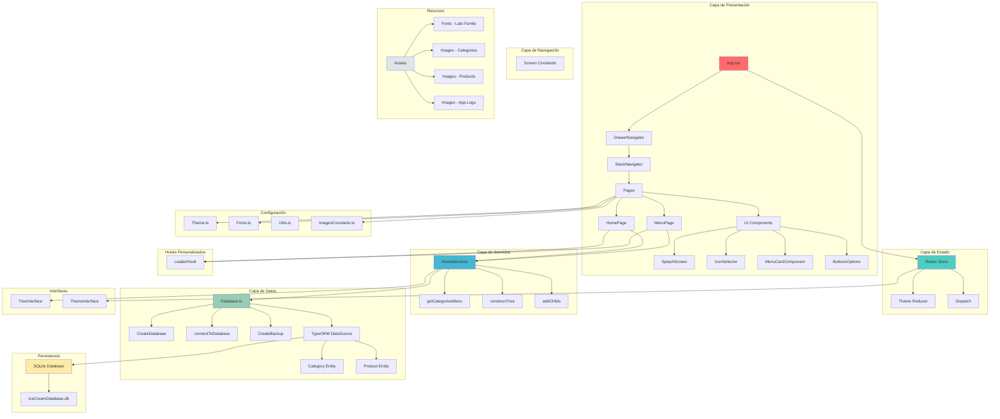
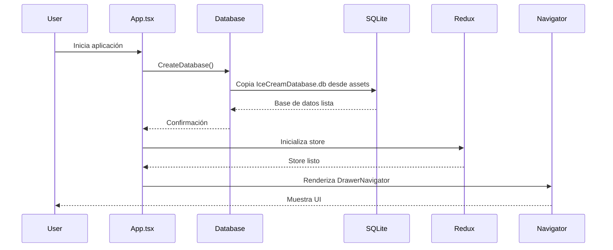
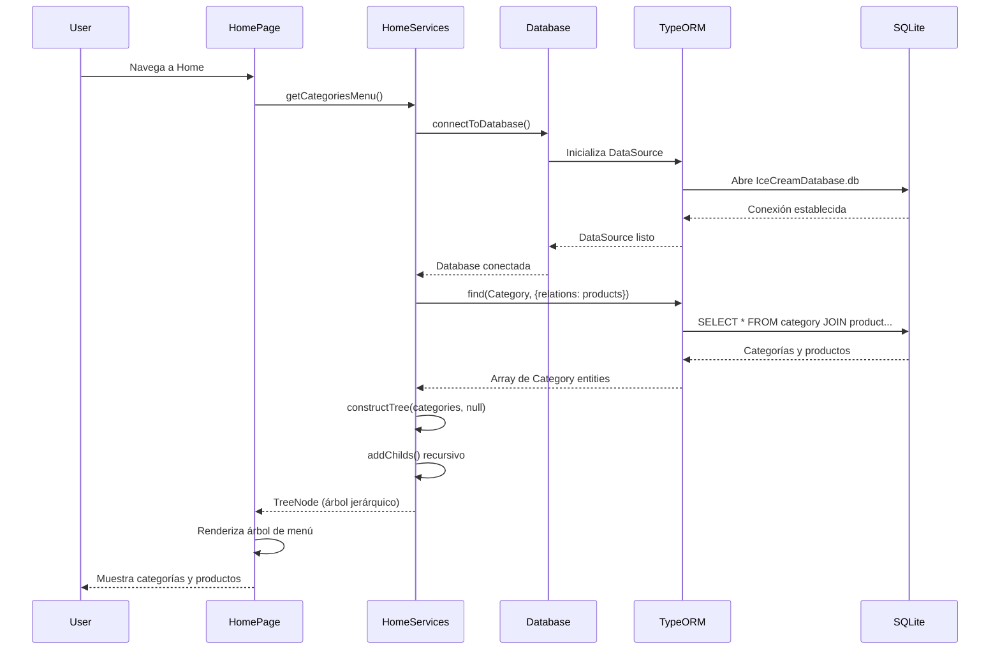
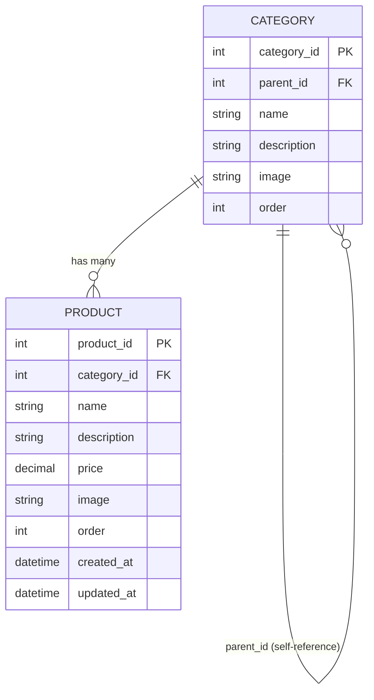

# Arquitectura del Proyecto: Ice Cream Management

## 1. Tecnologías Utilizadas

### Core Framework
- **React Native** `^0.73.5` - Framework principal para desarrollo móvil multiplataforma
- **React** `18.2.0` - Biblioteca de UI
- **TypeScript** `5.0.4` - Lenguaje de programación con tipado estático

### Navegación
- **@react-navigation/native** `^6.1.14` - Sistema de navegación base
- **@react-navigation/drawer** `^6.6.11` - Navegación tipo cajón lateral
- **@react-navigation/stack** `^6.3.25` - Navegación de pila
- **@react-navigation/native-stack** `^6.9.22` - Stack nativo optimizado
- **react-native-screens** `^3.29.0` - Componentes de pantalla nativos
- **react-native-safe-area-context** `^4.9.0` - Manejo de áreas seguras
- **react-native-gesture-handler** `^2.15.0` - Manejo de gestos
- **react-native-reanimated** `^3.7.2` - Animaciones de alto rendimiento

### Gestión de Estado
- **@reduxjs/toolkit** `^2.2.1` - Kit de herramientas Redux moderno
- **react-redux** `^9.1.0` - Bindings de React para Redux

### Base de Datos
- **TypeORM** `^0.3.20` - ORM (Object-Relational Mapping)
- **react-native-sqlite-storage** `^6.0.1` - Almacenamiento SQLite local

### Utilidades y Recursos
- **react-native-vector-icons** `^10.0.3` - Biblioteca de iconos
- **react-native-fs** `^2.20.0` - Sistema de archivos
- **react-native-permissions** `^4.1.4` - Manejo de permisos
- **react-native-asset** `^2.1.1` - Gestión de assets
- **rn-fetch-blob** `^0.12.0` - Manejo de archivos binarios

### Hardware & Periféricos
- **react-native-ect-thermal-receipt-printer** `^1.0.2` - Impresión de recibos térmicos

### Herramientas de Desarrollo
- **Babel** - Transpilador con soporte para decoradores TypeScript
  - `@babel/plugin-proposal-decorators` `^7.24.0`
  - `babel-plugin-transform-typescript-metadata` `^0.3.2`
- **ESLint** `^8.19.0` - Linter de código
- **Jest** `^29.6.3` - Framework de testing
- **Prettier** `2.8.8` - Formateador de código

## 2. Arquitectura del Sistema

### Patrón Arquitectónico
El proyecto implementa una **arquitectura en capas con patrón MVC/MVVM híbrido**:

```
Capa de Presentación (UI)
    ↓
Capa de Navegación
    ↓
Capa de Gestión de Estado (Redux)
    ↓
Capa de Servicios (Business Logic)
    ↓
Capa de Acceso a Datos (TypeORM)
    ↓
Capa de Persistencia (SQLite)
```

### Diagrama de Arquitectura



## 3. Estructura de Carpetas y Archivos

```
application/
│
├── android/                          # Configuración y código nativo Android
│   ├── app/
│   │   ├── build.gradle              # Configuración de build de Android
│   │   ├── src/main/
│   │   │   ├── AndroidManifest.xml   # Manifiesto de Android
│   │   │   ├── java/com/application/
│   │   │   │   ├── MainActivity.kt   # Actividad principal
│   │   │   │   └── MainApplication.kt # Aplicación principal
│   │   │   ├── assets/
│   │   │   │   ├── fonts/            # Fuentes Lato
│   │   │   │   └── custom/           # Base de datos pre-empaquetada
│   │   │   │       └── IceCreamDatabase.db
│   │   │   └── res/                  # Recursos Android (iconos, strings)
│   │   └── debug/
│   │       └── app-debug.apk         # APK de debug
│   ├── gradle/                       # Configuración Gradle
│   └── build.gradle                  # Build principal de Android
│
├── assets/                           # Recursos estáticos de la aplicación
│   ├── fonts/                        # Familia de fuentes Lato (10 variantes)
│   │   ├── Lato-Regular.ttf
│   │   ├── Lato-Bold.ttf
│   │   ├── Lato-Light.ttf
│   │   └── ...
│   └── images/
│       ├── app/                      # Imágenes de la aplicación
│       │   └── logo-sarita-1.png
│       ├── categories/               # Imágenes de categorías (32 imágenes)
│       │   ├── batidos.jpg
│       │   ├── cone.jpg
│       │   ├── pasteles.jpg
│       │   └── ...
│       └── products/                 # Imágenes de productos (12+ imágenes)
│           ├── milkshake.png
│           ├── nevada.png
│           └── ...
│
├── src/                              # Código fuente principal
│   │
│   ├── components/                   # Componentes reutilizables
│   │   ├── Home/
│   │   │   ├── MenuCardComponent.tsx # Tarjeta de menú
│   │   │   └── ButtonsOptions.tsx    # Botones de opciones
│   │   └── UI/
│   │       ├── SplashScreen.tsx      # Pantalla de carga
│   │       └── IconSelector.tsx      # Selector de iconos
│   │
│   ├── pages/                        # Páginas/Pantallas de la aplicación
│   │   ├── HomePage.tsx              # Página principal
│   │   └── MenuPage.tsx              # Página de menú
│   │
│   ├── routes/                       # Configuración de navegación
│   │   ├── DrawerNavigator.tsx       # Navegador de cajón
│   │   └── StackNavigator.tsx        # Navegador de pila
│   │
│   ├── services/                     # Lógica de negocio
│   │   └── HomeServices.ts           # Servicios del home
│   │       ├── getCategoriesMenu()   # Obtener árbol de categorías
│   │       ├── constructTree()       # Construir árbol desde lista plana
│   │       └── addChilds()           # Agregar hijos recursivamente
│   │
│   ├── store/                        # Gestión de estado y datos
│   │   ├── db/
│   │   │   └── Database.ts           # Configuración de base de datos
│   │   │       ├── CreateDatabase()  # Crear/copiar DB desde assets
│   │   │       ├── connectToDatabase() # Conectar con TypeORM
│   │   │       └── CreateBackup()    # Backup de base de datos
│   │   └── redux/
│   │       ├── store.ts              # Store de Redux
│   │       ├── themeReducer.ts       # Reducer de tema
│   │       └── dispatch.ts           # Dispatcher tipado
│   │
│   ├── entity/                       # Entidades TypeORM
│   │   ├── Category.entity.ts        # Entidad de categoría
│   │   │   ├── category_id (PK)
│   │   │   ├── parent_id (FK - auto-referencia)
│   │   │   ├── name
│   │   │   ├── description
│   │   │   ├── image
│   │   │   ├── order
│   │   │   └── products (1:N)
│   │   └── Product.entity.ts         # Entidad de producto
│   │       ├── product_id (PK)
│   │       ├── category_id (FK)
│   │       ├── name
│   │       ├── description
│   │       ├── price
│   │       ├── image
│   │       ├── order
│   │       ├── created_at
│   │       └── updated_at
│   │
│   ├── interface/                    # Interfaces TypeScript
│   │   ├── TreeInterface.ts          # Interfaz de árbol de categorías
│   │   │   └── TreeNode
│   │   └── themeInterface.ts         # Interfaz de tema
│   │
│   ├── styles/                       # Estilos y temas
│   │   └── Theme.ts                  # Definición de temas (light/dark)
│   │
│   ├── constants/                    # Constantes de la aplicación
│   │   ├── Fonts.ts                  # Constantes de fuentes
│   │   ├── utils.ts                  # Utilidades generales
│   │   └── navigation/
│   │       └── screeens.ts           # Nombres de pantallas
│   │
│   └── shared/                       # Utilidades compartidas
│       ├── LoaderHook.ts             # Hook de loading
│       └── ImagesConstants.ts        # Constantes de imágenes
│
├── __tests__/                        # Pruebas
│   └── App.test.tsx
│
├── App.tsx                           # Punto de entrada de la aplicación
├── app.json                          # Configuración de la app
├── package.json                      # Dependencias y scripts
├── tsconfig.json                     # Configuración TypeScript
├── babel.config.js                   # Configuración Babel
├── metro.config.js                   # Configuración Metro bundler
├── README.md                         # Documentación del proyecto
├── CLAUDE.md                         # Guía para Claude Code
└── ARCHITECTURE.md                   # Este documento
```

## 4. Flujo de Datos

### Inicialización de la Aplicación



### Flujo de Carga de Menú



## 5. Patrones de Diseño Implementados

### 1. Repository Pattern
- Los servicios (`HomeServices`) actúan como repositorios
- Abstracción de la lógica de acceso a datos
- Separación entre lógica de negocio y persistencia

### 2. Entity Pattern
- `Category.entity.ts` y `Product.entity.ts` representan modelos de datos
- Uso de decoradores TypeORM para mapeo objeto-relacional
- Relaciones definidas mediante decoradores (@OneToMany, @ManyToOne)

### 3. Composite Pattern
- Estructura de árbol jerárquico (TreeNode)
- Categorías pueden contener subcategorías recursivamente
- Método `constructTree()` construye el árbol compuesto

### 4. Provider Pattern
- Redux Provider envuelve la aplicación
- Provee el store a todos los componentes
- SafeAreaProvider y NavigationContainer también usan este patrón

### 5. Singleton Pattern
- Redux store es un singleton
- Instancia única de la base de datos TypeORM
- DataSource mantiene una única conexión

### 6. Strategy Pattern
- Diferentes navegadores (Drawer, Stack) intercambiables
- Temas (light/dark) como estrategias de estilizado

### 7. Observer Pattern
- Redux implementa el patrón observer
- Los componentes se suscriben a cambios del store
- Re-renderizado automático cuando cambia el estado

### 8. Factory Pattern
- `CreateDatabase()` actúa como factory
- Crea y configura la instancia de base de datos
- `connectToDatabase()` factory para DataSource de TypeORM

## 6. Características Arquitectónicas Clave

### Base de Datos Pre-empaquetada
- SQLite embebido con datos iniciales
- Ubicación: `android/app/src/main/assets/custom/IceCreamDatabase.db`
- Se copia al dispositivo en primera ejecución
- No se usa sincronización automática (synchronize: false)

### Estructura Jerárquica
- Categorías organizadas en árbol multinivel
- Auto-referencia mediante `parent_id`
- Productos ordenados por campo `order`
- Construcción recursiva del árbol en memoria

### Sistema de Temas
- Redux gestiona el tema actual
- Definiciones de tema en `Theme.ts`
- Actualmente configurado siempre en modo oscuro
- Preparado para toggle light/dark (código comentado)

### Tipado Fuerte
- TypeScript con modo estricto
- Interfaces para todas las estructuras de datos
- Decoradores experimentales habilitados para TypeORM
- Metadatos de decoradores emitidos

### Gestión de Assets
- Fuentes personalizadas (Lato) en múltiples pesos
- Imágenes organizadas por categorías y productos
- Constantes centralizadas para referencias de imágenes
- Link de assets a Android nativo

### Navegación Híbrida
- Combinación de Drawer y Stack navigation
- Safe area context para dispositivos con notch
- Gesture handler para interacciones nativas
- Animaciones con Reanimated

## 7. Consideraciones de Desarrollo

### Babel Configuration
- Soporte para decoradores TypeScript (legacy mode)
- Plugin de metadatos para reflexión TypeORM
- Preset de React Native

### TypeScript Configuration
- `experimentalDecorators: true` (requerido para TypeORM)
- `emitDecoratorMetadata: true` (reflexión en runtime)
- Modo estricto habilitado
- Resolución de módulos tipo Node

### Base de Datos
- No usar migraciones automáticas
- Modificar el archivo .db pre-empaquetado directamente
- Probar con instalación limpia después de cambios en DB
- Backup disponible mediante `CreateBackup()`

### Imágenes
- Preferir formato PNG sobre JPG (issue conocido con build Android)
- Organizar por tipo (categorías/productos)
- Referenciar mediante constantes centralizadas

### Performance
- Lazy loading de imágenes
- Construcción del árbol en memoria (no múltiples queries)
- Virtual lists para listas largas (React Native optimizado)
- SQLite local (sin latencia de red)

## 8. Puntos de Extensión

### Añadir Nuevas Pantallas
1. Crear componente en `src/pages/`
2. Definir constante en `src/constants/navigation/screeens.ts`
3. Agregar al navegador apropiado (`DrawerNavigator` o `StackNavigator`)

### Añadir Nuevas Entidades
1. Crear entity en `src/entity/` con decoradores TypeORM
2. Modificar base de datos pre-empaquetada
3. Agregar al array `entities` en `Database.ts`
4. Crear servicio correspondiente en `src/services/`

### Añadir Estado Global
1. Crear nuevo reducer en `src/store/redux/`
2. Agregar al store en `store.ts`
3. Crear actions y selectors
4. Conectar componentes mediante hooks de Redux

### Integrar Hardware
- Impresora térmica ya integrada (`react-native-ect-thermal-receipt-printer`)
- Permisos manejados mediante `react-native-permissions`
- File system disponible para exportar datos

## 9. Diagrama de Relaciones de Entidades



## 10. Stack Tecnológico Resumido

| Capa | Tecnología | Propósito |
|------|------------|-----------|
| **UI** | React Native + TypeScript | Interfaz de usuario multiplataforma |
| **Navegación** | React Navigation | Sistema de rutas y navegación |
| **Estado** | Redux Toolkit | Gestión de estado global |
| **Datos** | TypeORM | ORM para mapeo objeto-relacional |
| **Persistencia** | SQLite | Base de datos local embebida |
| **Estilizado** | StyleSheet + Tema Custom | Estilos y theming |
| **Assets** | Fuentes Lato + Imágenes PNG/JPG | Recursos visuales |
| **Testing** | Jest + React Test Renderer | Pruebas unitarias |
| **Build** | Metro + Gradle | Empaquetado y compilación |

---

**Versión del Documento**: 1.0
**Fecha**: 2025-10-12
**Autor**: Análisis arquitectónico generado por Claude Code
